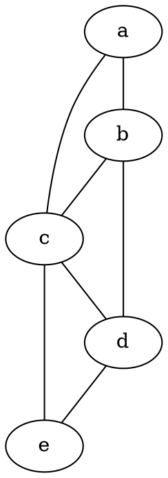

# Projeto de Algoritmos em Grafos 

Este projeto implementa os algoritmos de Prim, Bellman-Ford e Floyd-Warshall em Java, lendo grafos a partir de arquivos no formato DOT.

## Como Rodar o Projeto

### 1. Pré-requisitos

Antes de começar, você precisará ter o seguinte software instalado em sua máquina:

* **Java Development Kit (JDK)**: Versão 11 ou superior.
* **Apache Maven**: Para compilar o projeto e gerenciar as dependências.

### 2. Formato do Grafo de Entrada

O programa lê arquivos `.dot` ou `.gv` que seguem o padrão Graphviz. Para os algoritmos de caminhos mínimos e árvore geradora mínima, as arestas **devem** conter um atributo `weight` (peso).

**Exemplo (`grafo_teste.dot`):**


### 3. Compilando o Projeto (Build)

O projeto utiliza o Maven para compilar e empacotar todas as dependências em um único arquivo `.jar` executável (conhecido como "uber-jar").

1.  Abra um terminal na pasta raiz do projeto (onde o arquivo `pom.xml` está localizado).
2.  Execute o seguinte comando:

    ```bash
    mvn clean package
    ```

3.  Após a conclusão, você encontrará o arquivo executável em `target/trabalho-2-1.0-SNAPSHOT.jar`.

### 4. Executando o Programa

Para rodar o programa, utilize o comando `java -jar` e passe o caminho para o seu arquivo `.dot` como o primeiro argumento.

**Exemplo (usando o arquivo de teste na raiz do projeto):**

```bash
java -jar target/trabalho-2-1.0-SNAPSHOT.jar "grafo_teste.dot"
```

**Exemplo (passando um caminho completo para o arquivo):**

```bash
java -jar target/trabalho-2-1.0-SNAPSHOT.jar "C:\Meus Documentos\grafos\outro_grafo.gv"
```

A saída do programa mostrará o grafo que foi lido e, em seguida, os resultados da execução de cada um dos algoritmos (Prim, Bellman-Ford e Floyd-Warshall).
